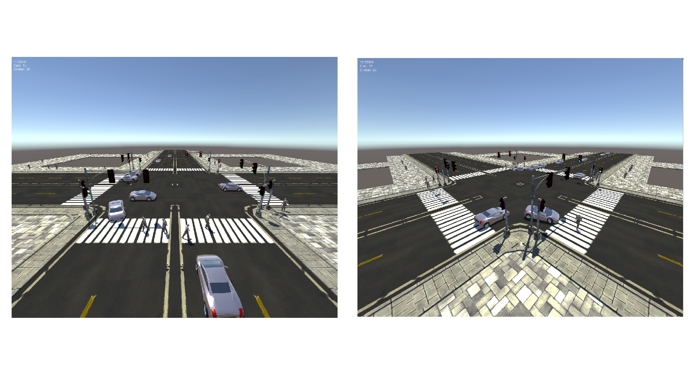
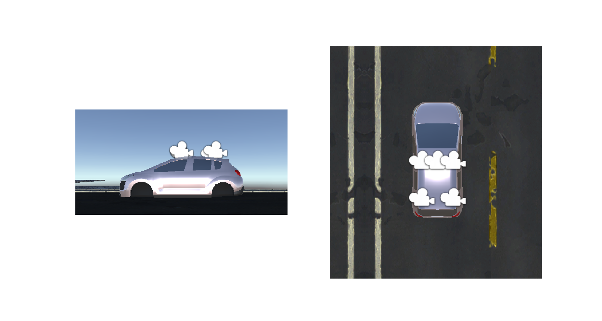
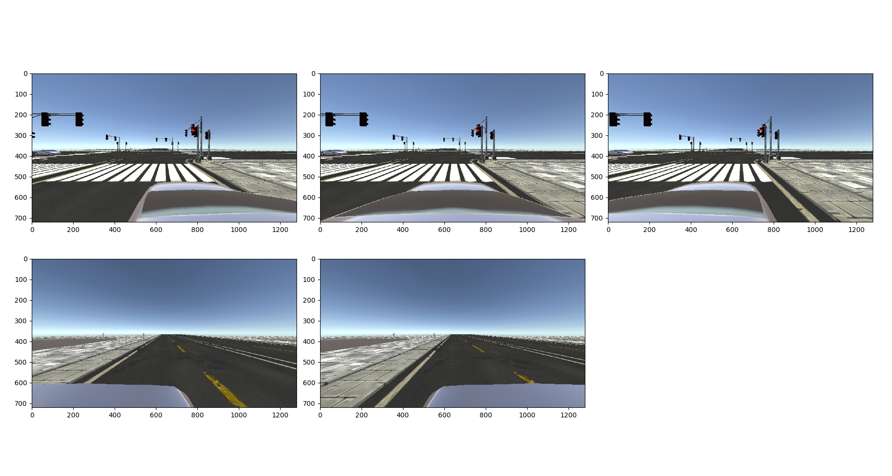

# SimCityEnv

This is a repo about building a simulated city. Now it only contains a roadnetwork, some traffic lights at crossroads, some automatic generated pedestrains and cars. Some basic traffic rules are used, such as green light means go and red light means stop. There are no buildings in this enviroment, because I do not find smaller building assets, and I do not want this repo too large just because the building models are too large.  

## Requirement

ml-agents
numpy
Python 3+

## Enviroment

### Roads

There are three roads along east-west direction, two of them have a length of 4 km, the other one has a length of 2 km. And four roads along north-south direction, two of them have a length of 3 kilometers, the other two roads have a length of 2 km. They cross with each other and form 10 crossroads. They are all four lanes road, two directions.  

### CrossRoads and traffic light

Some basic rules are implemented. Green light means go and red light means stop, for both cars and pedestrains. The green light last 20s, and then 3s of yello light. After 3s of red light, the green light of the other direction will be on and last another 20s.  

Cars on the outter lane may move straight forward or turn right, if they meet some pedestrains, they will stop waitting for the pedestrains passing though and then start moving. Cars on the inner lane can only go straight forward, they cannot turn right or left, it's a limit for them.  

Pedestrains walk on the sidewalk or zebra crossing. When they meet a car in front of them, they will stop until the car passing though, then they move on.  

### Cars and pedestrains

Cars are generated at the start of all those roads. They move forward, may turn around at the crossroad, may change lane at the middle point between two crossroads, until they reach another end of a road and are destroyed.  

Pedestrains are generated around all those crossroads. They move forward, cross the road and then are destroyed.  

## AgentCars

### Observation space

There are 5 cameras on the top of the Agent car, three of them face front and the other two face back. The speed of the agent car is also an output. So the observation space is five (720,1280,3) images and a scale.  

### Action space

The action space is a three dimension vector, it is (motorForwardOrBackward, turnLeftOrRight, isBrake).  

**motorForwardOrBackward**: This means the scale of the torque applying to the car makes it move forward or backward, and has a range of (-1, 1). The value is the scale to the max torque. So 0.7 means there is a 0.7 times of the maxTorque applying on the car to make it moving forward, and -0.3  means there is a 0.3 times of the maxTorque applying on the car to make it moving backward.

**turnLeftOrRight**: This means the scale of the angle the front wheel turning, and has a range of (-1, 1). The value is the scale of the max turning angle(30 degree). So 0.7 means the front wheel is turning right with 21 degree, and -0.3 means the front wheel is turning left with 9 degree.

**isBrake**: This means brake or not. 1 means brake and 0 means not.

### Reward and done

I am not sure about the reward, so now the reward is all zero. If the agent car falls out off the road, it will be reset to the start point.

## Demo

Just download this repo and run Demo_SC.py or Demo_TL.py.

## For player

### Traffic light

A small env that just contains one crossroad, there are eight viewpoint in it. Press 'Space' to change the viewpoint.

### SimCity.Beta

A roaming view of the simcity env. Press 'W' to move forward, 's' to move backward, 'a' to turn left, 'd' to turn right.
